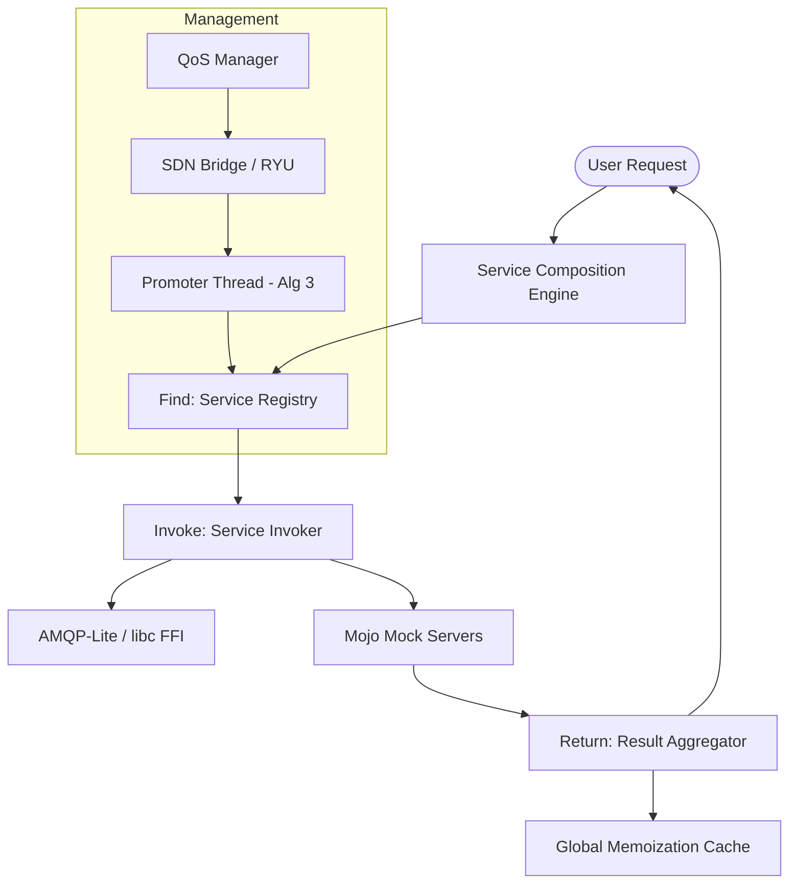

# FIRM: High-Performance Service Composition Framework

FIRM (Find, Invoke, Return, Manage) is a research-grade framework implemented in Mojo designed for high-performance service composition in distributed environments. FIRM leverages Mojo’s FFI and system-level performance.

## Key Features

- **High-Performance Networking**: Built on libc FFI (socket, send, recv) with a custom binary AMQP-Lite framing protocol for near-zero overhead communication.
- **Advanced Service Composition**: Supports complex DAG-based workflows and Software-Defined Workflows (SDW) with dicycle (loop) detection and execution.
- **Global Memoization**: A centralized MemoCache (using Python interop) allows results to be reused across different users and sessions, significantly reducing redundant computation and network traffic.
- **Resilient QoS Management**: Continuous monitoring of service latency with automated failover, blacklisting, and a Self-Healing Promoter Thread (Algorithm 3) that re-integrates nodes via a coin-flip heuristic.
- **MapReduce Orchestration**: Integrated MapReduceCoordinator for managing distributed batch jobs (Sync with Figure 4 of the paper).
- **Dynamic Topology**: Nginx-style configuration (services.conf) for defining service endpoints, thresholds, and connectivity.

## Architecture



## Usage

### Installation
Install the Mojo SDK via the provided setup script:

```bash
bash setup.sh
```

This installs [Pixi](https://pixi.sh), initializes the project, adds the Modular and conda-forge channels, and installs Mojo. After setup, enter the environment with:

```bash
pixi shell
```

### Running the Demonstration
Execute the main framework demonstration:
```bash
pixi run mojo main.mojo
```

### Running Benchmarks
```bash
pixi run mojo benchmark.mojo
```

### Configuration
Services and QoS thresholds are defined in services.conf:
```nginx
service PaymentService {
    host 127.0.0.1;
    port 8080;
    threshold 100ms;
}
```

## Research Context
This implementation provides the functional building blocks for the FIRM framework, enabling researchers to validate service composition strategies in a high-performance, low-latency environment.

## Citation

If you use this work in your research, please cite the following publication:

* Kathiravelu, P., Grbac, T.G. and Veiga, L., 2016, May. **A FIRM approach for software-defined service composition.** In 2016 39th International Convention on Information and Communication Technology, Electronics and Microelectronics (MIPRO) (pp. 565-570). IEEE.
